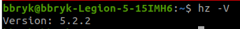
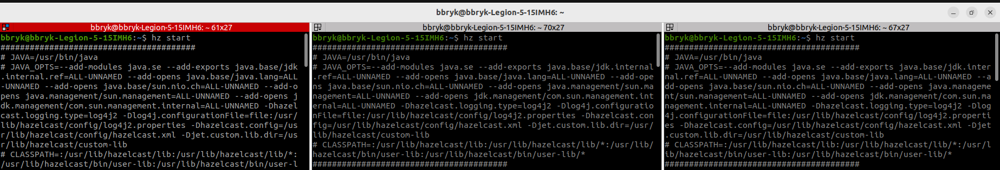
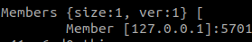
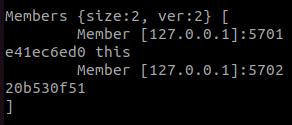
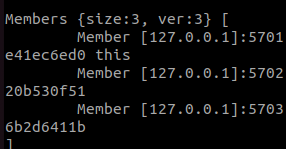
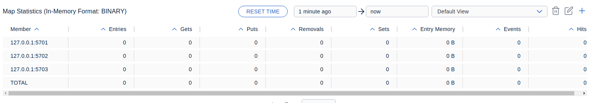
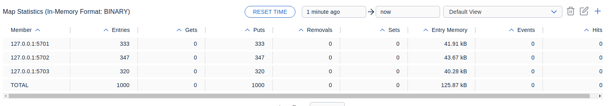
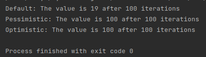

# Microservices2
# Task1:  
Hazelcast is installed  

# Task2:  
3 nodes are running
  
Detection of other clusters:  
  
  
  

# Task3:  
Empty map:  

Filled map:  

The distributed map uses all of three clusters, but not perfectly equally.  

# Task4:  

The loss is in the default method, and no loss in pessimistic and optimistic methods
